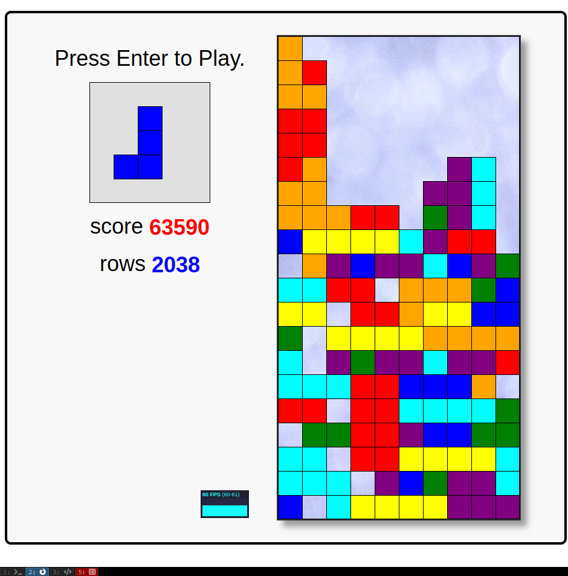

## Getting the original agent to work

When I first launched the game and understood how to activate the heuristic agent, I noticed that it doesn't really work - block placements are seemingly random, and several games were lost very quickly. I heard from some of my friends that there were some (perhaps intentional) bugs in the algorithm - the agent very rarely placed blocks at the edges of the board, which was evident from the way the endgame looked like.

As someone who has coded Tetris clones before, I assumed it had something to do with rotations - this mechanic usually causes the most bugs. And indeed, the function that generates all possible moves seemed to miss some (literally) "edge" cases, when the block only fitted on the screen when rotated in a specific way. So I decided to go a bit over the bounds and then for every move, individually check if it's legal.

The results got slightly better, but the bot kept on losing very quickly. I continued testing, and got more and more confused as the time went on. and after my last "fix", some blocks even got placed out of bounds, although I explicitly checked that they weren't, which was driving me even more insane. The move generator worked fine now, so I went on to review the cost function and even tried tweaking some weights, but to no avail. It seemed like a reasonable move was selected, but then the agent didn't play it. After some manual inspection, I noticed that blocks were always placed in the correct spot, but the rotation was wrong, which led me to conclude they were somehow passed wrongly; and indeed, the block was passed by reference, not copied, so it got rotated after being selected. After I fixed the code to deep copy blocks instead, everything started working.

## Optimization

I first tried doing gradient descent on the 4 weights in the `evaluateBoard()` function. But I ran into a problem - end score varied a lot from game to game, and it was nearly impossible to evaluate a reliable loss function from the weights. Due to that, gradient descent gave quite a chaotic result even when I tried taking the median of $10$ games. I could've tried running more games, but $10$ games already required a lot of computational power, given the inefficiency of JavaScript.

I also added another metric to the evaluation function - if `maxHeight < 6 && holes === 0 && completeLines === 0` and the new piece gets placed in the leftmost column, decrease the score by $4$. This is meant to encourage the agent to keep the leftmost column empty as long as the game position is good enough - this allows for more combos.

This has resulted in at least one good game (score overflowed):

